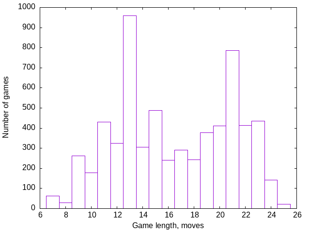
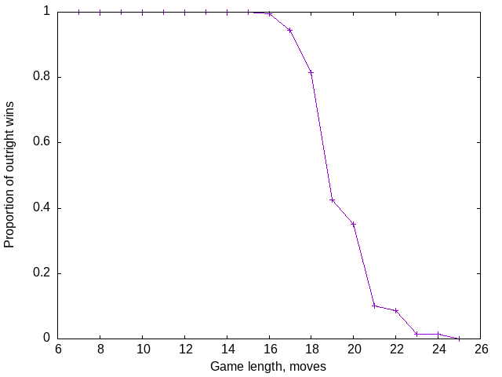

# Algorithmic Player Comparison

I have four algorithmic players in this [repo](https://github.com/bediger4000/squava2).

1. Alpha-beta minimaxing
2. Alpha-beta minimaxing with a better static evaluation function
3. Monte Carlo Tree Search
4. Monte Carlo Tree Search with UCT child selection

At this point, all but plain MCTS (#3 above) regularly beat me.
How do my programmatic squava players do against
each other?

<!--more-->

I ran a round-robin tournament to find out
which player is best.
Four "players", each one as player 1 and as player 2,
to determine if there's a first-player-advantage.
16 match-ups, 400 games in each match-up,
for 6400 games total.

### Most Games Won

Ignoring match-ups where the first and second players are the same,
there's 4800 total games.
Here's who won the most games:

|Player    | Games won|
|:----------:|:-----:|
|MCTS/UCB1|1648|
|A/B+Avoid|1506|
|AlphaBeta|1273|
|MCTS/Plain|373|

I agree with this ranking.
MCTS/UCB1 is the best player,
Alpha-Beta minimaxing with the better static valuation function is almost as good.
Plain MCTS is easily the worst of the four players.

I think the Alpha-beta minimaxing players aren't as good because I haven't
discovered the best static valuation function.
Additionally, I limited the number of moves an Alpha-beta player looks ahead
at the beginning of the game.
There's so many response moves at the beginning of the game
that a large look ahead takes a very long time.
For the first 4 moves, I limit the look ahead to 8 further moves.
Between 5 and 10 moves into the game, I limit look ahead to 10,
and after 10 moves into the game, look ahead limited to 12 further moves.
Alpha-beta minimaxing players absolutely do not look ahead to the end of the game
until maybe the 8th move of a game.
When playing against an Alpha-beta minimaxing player,
humans will notice a large increase in computer computation time 
at the 5th move.

### More nuanced view


|Moves First|Moves Second|First wins|Second wins|Mean moves|Median moves|Min moves|Max moves|
|:----:|:----:|----:|----:|----:|----:|----:|----:|----:|
|A|A|189|211|19.52|21|13|24|
|A|G|146|254|19.48|20|13|24|
|A|M|344|56|14.18|13|7|25|
|  A|  U|  207|  193|17.59|19|9|25|
|G|A|239|161|19.13|21|11|24|
|G|G|195|205|19.30|21|12|24|
|G|M|358|42|13.85|13|7|25|
|G|U|213|187|17.63|18.5|9|25|
|M|A|93|307|15.60|14|8|24|
|M|G|82|318|15.15|14|8|24|
|M|M|274|126|12.21|11|7|24|
|M|U|79|321|14.65|14|8|24|
|U|A|292|108|17.77|18|10|24|
|U|G|276|124|18.61|19|10|24|
|U|M|379|21|11.99|11|7|24|
|U|U|188|212|17.34|19|11|23|

* A: Alpha-beta minimaxing
* G: Alpha-beta minimaxing with a somewhat better static evaluation function
* M: Monte Carlo Tree Search
* U: Monte Carlo Tree Search with UCT child node selection

### Comparing self-competing players

I consider the A-A, G-G and U-U lines in the table above to be 50-50.
The M-M line is not
Why isn't the M vs M competition 50:50?

Plain Monte Carlo Tree Search does only a single playout per new child node.
It's common for it to find a single losing playout on a child node
that if examined further, would end up as a good move.
The MCTS algorithm doesn't allow further exploration of consequences
of a move that it (randomly!) finds a loss for.
It ends up picking some bad moves.
I think this explains why plain Monte Carlo Tree Search scores the worst in 
every match-up.
Monte Carlo Tree Search with UCT child selection remedies this by giving
a higher score (for search) to some moves that have relatively unexplored
consequences.

### Does first or second player have an advantage?

|Player|wins moving 1st|wins moving 2nd|
|:----------:|:------:|:------:|
|MCTS/UCB1|947|701|
|A/B+Avoid|810|696|
|AlphaBeta|697|576|
|MCTS/Plain|254|119|

Looks like maybe the first player has an advantage,
although that advantage isn't overwhelming.

The lines for A-A, G-G, M-A and M-G 
in the "More Nuanced View" table above
could fool you into thinking
that the Alpha-beta minimaxing algorithms have a second player advantage.
I don't think that's true, I believe the scores are an artifact of
randomness for the A-A and G-G cases, and the fact that plain MCTS
is the worst player for the M-A and M-G cases.

### Do players win outright, or force the other player to lose?

Squava the game has outright wins (getting 4-in-a-row)
and outright losses (getting 3-in-a-row, without 4-in-a-row).
Do players win outright or force the other player into a loss?

|First       |Second       |First won |Second lost|Second won|First lost|
|:----------:|:-----------:|:--------:|:---------:|:--------:|:--------:|
|      U     |      A      |       157|        135|        94|        14|
|      U     |      G      |       103|        173|        95|        29|
|      U     |      M      |       359|         20|        13|         8|
|      G     |      A      |       153|         86|        31|       130|
|      G     |      M      |       351|          7|         2|        40|
|      G     |      U      |       208|          5|        16|       171|
|      A     |      G      |        95|         51|        72|       182|
|      A     |      M      |       338|          6|         1|        55|
|      A     |      U      |       203|          4|        20|       173|
|      M     |      A      |        38|         55|       283|        24|
|      M     |      G      |        38|         44|       296|        22|
|      M     |      U      |        41|         38|       286|        35|

Looks like the Alpha-beta minimaxing players tend to win outright,
while the MCTS/UCB1 player mixes up wins and forcing losses.
The plain MCTS player lets other players win outright.
It kind of sucks.

### Game length

Here's a histogram of the length of games in my tournament.



13- and 21-move games predominate.

The first player won outright all of the 13-move games,
but all 4 players won some 13-move games.

Of the 785 21-move games, the first player lost outright 705 games,
while the first player won outright 80 games.
The vast bulk of the 21-move games ended up with the players avoiding
3-in-a-row outright losses.

My thought is that 13-move games are about the practical limit of
getting an outright win by setting up an outright loss if the losing
player were to block the win.
21-move games are the practical limit of avoiding-a-loss end games.



The plot above shows that Squava does have openings,
a middle game, and an end game.
Before the 18th move of a game,
it's almost impossible to force an outright loss.
If you force a loss on your opponent on move 16 or 17,
you're very wily.
Between moves 17 and 20, you can win by outright getting 4-in-a-row,
or by cleverly forcing a 3-in-a-row loss on your opponent.
After the 21st move, it's difficult to win, you have to avoid outright losses.
An end game begins at about the 21st move.

#### 7 move games

My tournament included 63, 7-move games,
the Squava equivalent of chess' Fool's Mate.
All 64 7-move games were won outright by the first player (of course).
The first player was all 4 of the algorithms.
The second player was always plain ol' MCTS.
This is more an illustration of plain MCTS lucking into ways
to not make obvious blocks than anything else.

#### 25 move games

There's 25 slots for player's to fill in on a Squava board.
The maximum game length is 25 moves.
21, 25-move games appear in the tournament results,
but only 5 unique final boards exist 
after considering rotations and mirroring.
The first player loses
all of these games outright, with a forced 3-in-a-row.
All of the 25-move games have an Alpha-beta minimaxing player moving first,
and an MCTS player moving second.
There's got to be something hidden in that, but I can't figure it out.

### Analysis of first moves

Here's a count of all the opening moves made during the tournament,
in the location in which they're made:

```
     0    1    2    3    4
0  133  190  127  189  132
1  157  478  187  503  196
2  118  175 1167  201  119
3  189  476  204  476  175
4  149  208  123  192  136
```

For all intents and purposes,
the opening moves are symmetric with respect to reflections.

Folding them all together via reflections, I get this count:

```
     0    1    2    3    4
0  550  779  250    0    0
1  717 1933  391    0    0
2  237  376 1167    0    0
3    0    0    0    0    0
4    0    0    0    0    0
```

I'm not surprised that 1,1 is the favorite opening move,
but 2,2 is confounding.
Peiyan Yang's [full game analysis](https://github.com/iForgot321/Squava)
has 2,0; 2,1; 2;2 and 0,2; 1,2 as winning moves for the **second**
player.

The choice of 2,2 as an opening move is down almost exclusively
to the MCTS with UCB1 player:

```
     0   1   2   3   4
0    0   0   0   0   0
1    0 190   0 200   0
2    0   0 842   0   0
3    0 185   0 183   0
4    0   0   0   0   0
```
About half of the time MCTS/UCB1 chose 2,2 as an opening move.
Notice the symmetry of it's opening moves,
I think this aligns with the MCTS/UCB1 code being correct.
Of those 842 games with 2,2 opening moves,
MCTS/UCB1 won outright 290 games, won by forcing a loss on 147 games,
and lost 405 games.
MCTS/UCB1 won just over half the games it opened with 2,2.

The most common response by far to a 1,1; 1,3; 3,1; or 3,3 opening move
is 2,2.

The most common response to a 2,2 opening is one of 1,1; 1,3; 3,1 or 3,3.
